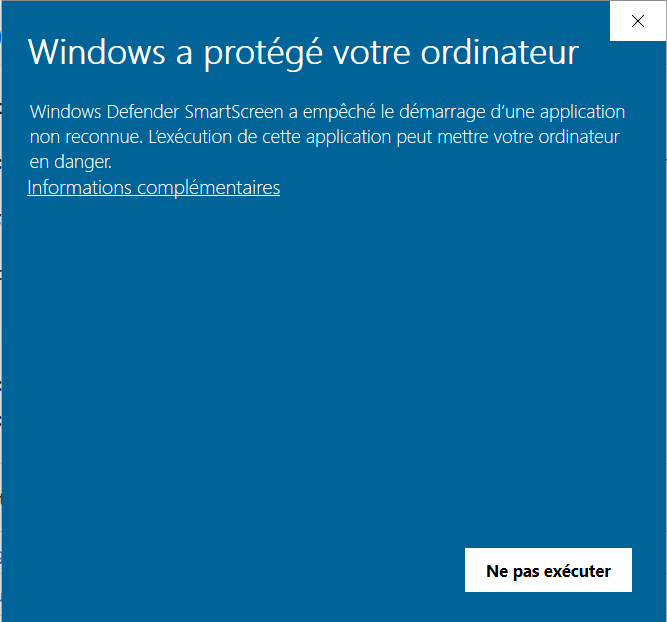
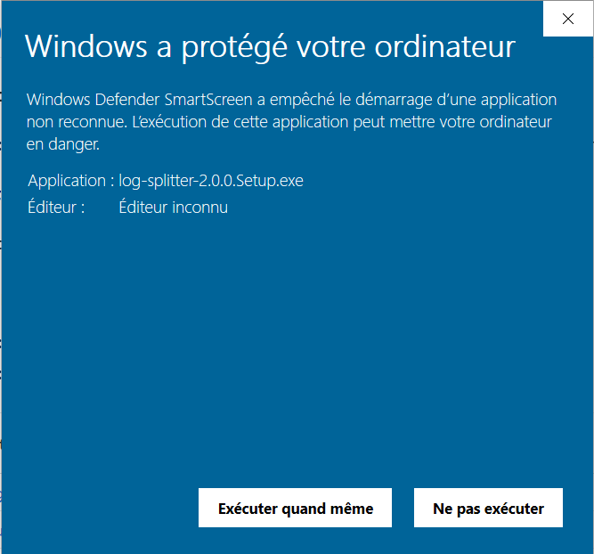

# Log splitter 🦑

Log-splitter is a easy to use software developped specifically to split a single big log file into separate files.

## Usage

You may download the installer from the release page: [latest version](https://github.com/Gaspacchio/log-splitter/releases/latest).

Then, just execute the installer and run log-splitter just as any other regular program.

### step-by-step instructions

1. Select the log to process by clicking on the first button located in the card labelled "This is the log". The card should turn green if the log is valid.
2. Select the folder to save the files by clicking on the second button located in the card labelled "This is the destination". The card should turn green if the folder path is valid.
3. Click on the "start" button.

You may repeat this process as much as you need.

**⚠️ WARNING: as of today, files will be silently overwritten, so make sure that you are in the right directory before hitting the "start" button.**

## Common problems

### installation

#### antivirus software may interfere with the installation

Because this program is really specific, it is not often downloaded neither installed. If you can't install , try to turn off your antivirus temporarly.

#### Windows protected your PC

As stated before, because the program is not well known, Windows Smartscreen may prevent you from installing the software.

If this happens, click on the "More info" link and select "Run anyway".

